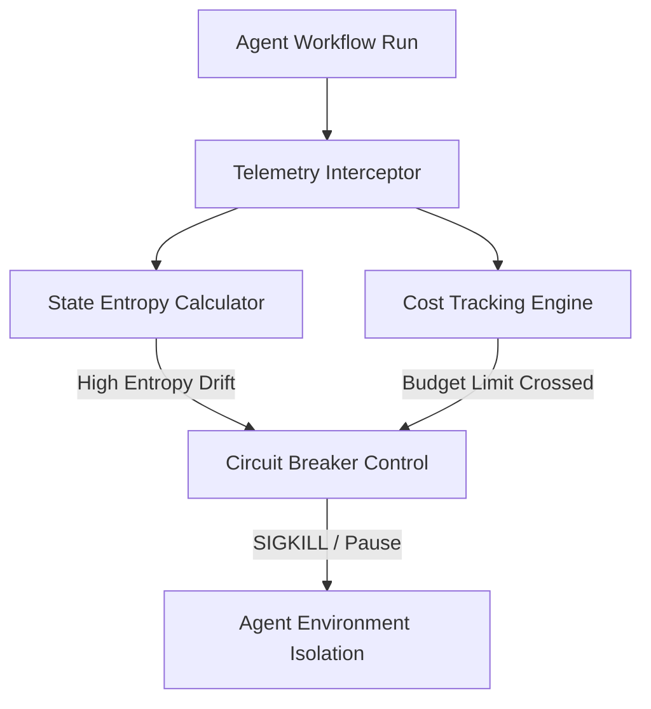

# Imperium Core

An advanced, multi-agent orchestration engine designed for autonomous system synchronization, self-healing workflows, and digital sovereignty. Built for high-throughput execution environments requiring zero-latency state tracking.

## 🚀 Key Features

- **Multi-Agent Orchestration:** Dynamic task allocation across autonomous agents with real-time feedback loops.
- **Self-Healing Code Execution:** Automated telemetry interception with automatic circuit-breaking capabilities.
- **Sovereign Infrastructure:** Built for containerized, self-hosted deployment pipelines (Docker / Coolify compatible).
- **Advanced Cost Tracking:** Deep analytical budget gating to prevent API cost overruns during high-entropy workflows.

## 🛠️ Architecture Overview

The system utilizes an agentic workflow model to calculate state entropy drift and intercept telemetry data before it reaches the core execution environment.


## Getting Started
Clone the repository

```
git clone [https://github.com/redfoxstore11-max/imperium-core.git](https://github.com/redfoxstore11-max/imperium-core.git)

# Navigate to the directory
cd imperium-core

# Initialize configuration
cp .env.example .env

# Start the core engine
docker-compose up -d
```

